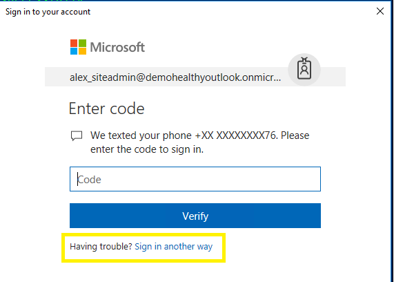
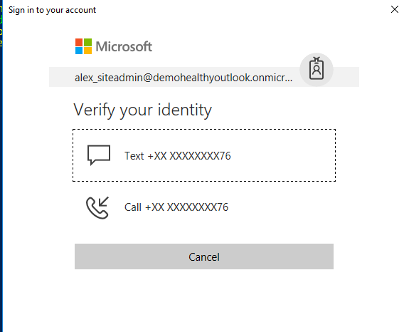
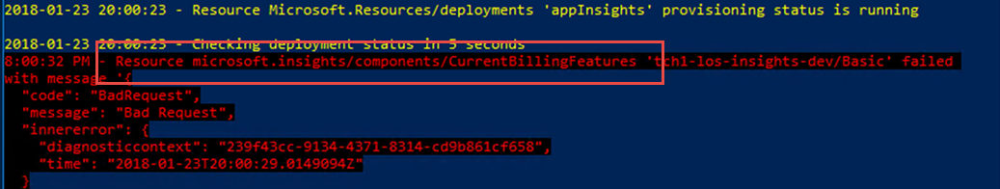

# Azure HIPAA/HITRUST Health Data and AI - with (IaaS Extension) PREVIEW


**Why am I unable to log in or run the PowerShell scripts with my Azure
subscription user?**

You are required to create an Azure Active Directory (AAD) administrator
as specified in the document. An active directory account is required because a subscription
admin does not automatically receive DS or AAD credentials. 

**I get the following error "cannot be loaded because running scripts is
disabled on this system. For more information, see
about\_Execution\_Policies"**

You can correct the permissions locally by running the following command:
```
Set-ExecutionPolicy -ExecutionPolicy Bypass -Scope CurrentUser -Force
```

**I enabled MFA, and the demo does not run?**

 MFA is an advanced feature. This feature will make the deployment process require attention to how [Azure MFA](https://docs.microsoft.com/en-us/azure/multi-factor-authentication/multi-factor-authentication-whats-next) operates. 

Once -mfa is enabled the deployment WILL - 
1.	Enforce MFA for global AD admins
2.	Enforce a separation between AD Administrator and Subscription Administrator (Owner/Constributor)
3.	Enforcing MFA at the user level 

- Note that rerunning the deployment after MFA is enabled will result in failure, unless MFA users are manually removed. 

 - MFA will block/fail the re-deployment process as it attempts to login with the Site-Admin credentials with the credentials provided
- 	Unable to perform Ingestion after enabling MFA. (Demo requires hands on changes to run with MFA enabled) To mitigate the -mfa switch – You will need to manually upload blob using Azure Portal or Storage explorer. Make sure you use Debra_DataScientist account to login and upload a training data – LengthOfStay.csv (blob).

https://docs.microsoft.com/en-us/azure/storage/blobs/storage-quickstart-blobs-portal#upload-a-block-blob 

**Over the Phone (OTP) call back failed for MFA?**

If you did not receive you OTP try resending the request in MFA.


Select the appropriate call back




**When I run the deployment script, it tells me that a module is
missing**

The script requires the following PowerShell modules:

'AzureRM' = 4.4.0\
'AzureAD' = 2.0.0.131\
'SqlServer' = 21.0.17199\
'MSOnline' = 1.1.166.0

The script tries to unload and load the correct scripts running deploy.ps1 -installmodule. This will happen if permissions are not set correctly
on the local computer, or module permissions were changed. 

If a module fails it's recommended that you remove the modules from your PowerShell install directory, and then
rerun the deploy.ps1 -installmodule command.

**Why do I need to add my subscription administrator to the AAD Admin
role?**

Role-based access control requires that the deployment use administrator rights in AAD. For a detailed explanation, see:

-   [Delegating Admin Rights in Microsoft
    Azure](https://www.petri.com/delegating-admin-rights-in-microsoft-azure)

-   [PowerShell - Connecting to Azure Active Directory using Microsoft
    Account](http://stackoverflow.com/questions/29485364/powershell-connecting-to-azure-active-directory-using-microsoft-account)

**Are there third-party solutions that can help achieve or manage
Healthcare HIPAA  compliance?**

Third-party products can help with continuous compliance efforts.
Examples of the products available in the Azure marketplace:

- **Continuous Compliance Monitoring**       [Cloudneeti - - Cybersecurity & Compliance Assurance](https://azuremarketplace.microsoft.com/en-us/marketplace/apps/cloudneeti.cloudneeti_enterpise?tab=Overview)
- **Network Security and Management**        [Azure Marketplace: Network Security](https://azuremarketplace.microsoft.com/en-us/marketplace/apps/category/networking?page=1)
- **Extending Identity Security**            [Azure Marketplace: Security + Identity](https://azuremarketplace.microsoft.com/en-us/marketplace/apps/category/security-identity?page=1)
- **Extending Monitoring and Diagnostics**   [Azure Marketplace: Monitoring + Diagnostics](https://azuremarketplace.microsoft.com/en-us/marketplace/apps/category/monitoring-management?page=1&subcategories=monitoring-diagnostics)


**Why do I need to set up some permissions, Security Center, and OMS
ingestion manually?**

Some monitoring capabilities do not offer hooks to automate at this
time. See the deployment guidance documents for instructions to
enable the features manually.

**Why does the Resource Manager template fail to run because of my password
complexity?**

Strong passwords are recommended
throughout the solution, for example, 15 characters, with upper and lower-case
letters, at least 1 number, and 1 special character. 

**How do I use this solution in my production deployment environment?**

This solution (including the scripts, template, and documentation) is
designed to help you build a pilot or demo site. Using this solution
does not provide a ready-to-production solution.
This solution illustrates the components required to build a more secure end-to-end
solution. 


**What else should I consider once the solution is installed?**

Once the script has completed, you should consider resetting your
administrative passwords, including your ADsqladmin and Admin users. The
following command can be used to quickly reset passwords in PowerShell:
```
Set-MsolUserPassword -userPrincipalName *\<youradmin@yourdomain\>*-NewPassword *\<newpassword\>* ‑ForceChangePassword \$false
```
**When I Run .\\HealthcareDemo.ps1 -deploymentPrefix prefix -Operation
Ingestion I get a permission error.**

The script was not provided the correct permissions. To grant permissions in Azure Active Directory:

1.  In the Azure portal, click **Azure Active Directory** in the
    sidebar.

2.  Click **App registrations**.

3.  Click *\<deployment-prefix\>* **Azure HIPAA LOS Sample**.

4.  Click **Required permissions**.

5.  Click **Grant Permissions** at top. You are asked if you want to
    grant permissions for all accounts in the current directory. Click
    **Yes**.
	
**I redeploy the solution after an error... and it fails due to a 'cache' error, such as a token is duplicate**

Due to PowerShell's limitations, caching users information may at times cause errors. It's recommended you close and reopen your PowerShell session to clear any local caches. 

**I get an error while deployment at 'appInsights' step of the script. I noticed the error is related to a /CurrentBillingFeatures**


The error is due to the licensing model of your OMS/appInsights. You can correct the script by adding an enterprise plan in Azure Portal, or changing the deployment method:
0 – Set up App Insights with Application Insights Basic Plan.

1 – Set up App insights with Application Insights Enterprise Plan.

2 –  Only deploys App Insights without any billing plan. 

Subscriptions such as BizSpark, where there is a spending limit, the use of option "2" is required. 
```
.\deploy.ps1 -deploymentPrefix <1-5-length-prefix> `
             -tenantId <tenant-id> `
             -tenantDomain <tenant-domain> `
             -subscriptionId <subscription-id> `
             -globalAdminUsername <username> `
             -deploymentPassword Hcbnt54%kQoNs62`
             -appInsightsPlan 2            
```

**Since we have different groups managing our AAD and Subscriptions would I need to do something different to deploy the solution?**

Organization that has separate team for managing AAD and Subscription will need to some additional modifications before running this solution. This solution currently assumes both AAD and Subscription are managed by single entity (Alex_SiteAdmin). 

**How do I reset the Administrator password?**

Review this guide to [Reset your administrator password](https://docs.microsoft.com/en-us/azure/active-directory/active-directory-passwords-update-your-own-password#change-my-password) 

**How do I solve my connection error Invoke-Sqlcmd: Cannot open server 'XXXX-los-sql-dev' requested by the login.**

To make the deployment simple, the blueprint enroles your deployment device IP to the SQL Server firewall.
If you are getting deployment error, then likely that the deployment is not recognizing your local IP.

```
Invoke-Sqlcmd : Cannot open server 'XXXX-los-sql-dev' requested by the login. Client with IP address ‘xxx’
is not allowed to access the server.  To enable access, use the Windows Azure Management Portal or run
sp_set_firewall_rule on the master database to create a firewall rule for this IP address or address range.  It may
take up to five minutes for this change to take effect.
```

This error happens if you are:
-	Behind Organization NAT devices, 
-	Using Dynamic IPs 
-	Tried running the deployment scripts through Azure CloudShell
-	using IPV6 addresses only

To correct, you can customize the scripts to have an IP range block updated to the SQL Server firewall. Or you can look up your IP addresses using https://ipinfo.io/json and Follow the following steps for [Azure SQL Database server-level and database-level firewall rules](https://docs.microsoft.com/en-us/azure/sql-database/sql-database-firewall-configure)  to manage your IP address range.


**Can I enable additional SQL auditing?**

The blueprint enables SQL Server Auditing and all the databases contained will inherit the auditing profile. The script does not enable SQL DB auditing to avoid double logging and  additional costs. Refer the [SQL article](https://docs.microsoft.com/en-us/azure/sql-database/sql-database-auditing#subheading-8) 

It's important to note that you should avoid enabling both server blob auditing and database blob auditing together, unless:

-   You want to use a different storage account or retention period for a specific database.
-   You want to audit event types or categories for a specific database that differ from the rest of the databases on the server. 

**How can I enable KeyVault SoftDelete?**

The Blueprint  ships the enableSoftDelete flag enabled as of April 9th.
Soft-delete recovery option can be enabled, where deleted keys, secrets, and even entire vault instances are recoverable within ninety (90) days of deletion. The option effectively retains the deleted items in non-deallocated memory for the recovery period, with automatic deallocation (that is, permanent deletion) once the items have exceeded the period. To enable softdelete review [Keyvault Azure Key Vault Recovery Options using Powershell](https://blogs.technet.microsoft.com/kv/2017/05/10/azure-key-vault-recovery-options/) and [Azure Resource Manager Keyvault Schema](https://github.com/Azure/azure-resource-manager-schemas/blob/master/schemas/2016-10-01/Microsoft.KeyVault.json) - review the enableSoftDelete section.


**How do I deploy the solution to another region?**

The solution is set up to deploy in the West Central US. region. You can modify the scripts to deploy to other supported regions. It's important to verify that the region you pick has all the listed solution services [availible](https://azure.microsoft.com/en-us/regions/services/). 


**The sample illustrates using a new Azure Disk Encryption extension deployment feature that may result in a incorrect flag**  

Azure Security Center may incorrectly flag the VM as still needing to enable disk encryption.  This will be fixed in a future update.


# Disclaimer and acknowledgments
February 2018

This document is for informational purposes only. MICROSOFT AND AVYAN MAKE NO WARRANTIES, EXPRESS, IMPLIED, OR STATUTORY, AS TO THE INFORMATION IN THIS DOCUMENT. This document is provided “as-is.” Information and views expressed in this document, including URL and other Internet website references, may change without notice. Customers reading this document bear the risk of using it.
This document does not provide customers with any legal rights to any intellectual property in any Microsoft or Avyan product or solutions.
Customers may copy and use this document for internal reference purposes.

**Note**

Certain recommendations in this solution may result in increased data, network, or compute resource usage in Azure. The solution may increase a customer’s Azure license or subscription costs.

The solution in this document is intended as an architecture and must not be used as-is for production purposes. Achieving Health compliance (such as HIPAA, or HITRUST) requires that customers consult with compliance or audit office.  

All customer names, transaction records, and any related data on this page are fictitious, created for the purpose of this architecture, and provided for illustration only. No real association or connection is intended, and none should be inferred.
This solution was designed by Microsoft with development support from Avyan Consulting The work in its entirety, or parts is available under the [MIT License](https://opensource.org/licenses/MIT).
This solution has been reviewed by Coalfire, a Microsoft auditor. The HIPAA, and HITRUST Compliance Review provides an independent, third-party review of the solution, and components that need to be addressed.

